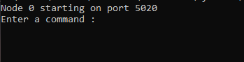
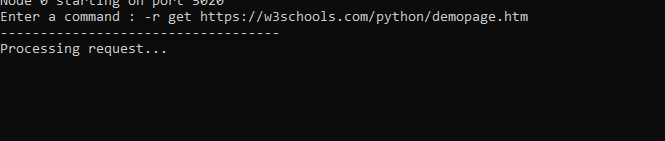
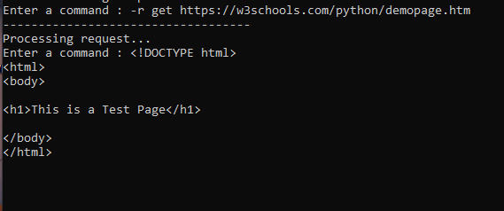
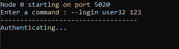
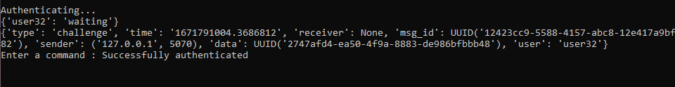

# ELEC-H417_Group1_Project  
  
This project consists in designing a peer to peer TOR network, able to admit and manage a variable number of peers, and allow those peers to anonymously send requests to a server.  

A detailed report of the project is given in `[ELECH417]_GROUP_01_Project_Report.pdf`

## Dependencies

The required libraries, included in `requirement.txt`, are the following :

- [PyCryptodome](https://pycryptodome.readthedocs.io/en/latest/#) : a library for cryptography
- [PyDH](https://pypi.org/project/pyDH/) : a library implementing a Diffie-Hellman key exchange
- [Requests](https://requests.readthedocs.io/en/latest/) : a simple HTTP library

They can be easily with pip :  `pip install pycryptodome `  

## Running the scripts

Currently, everything runs locally on the localhost. 

To start the network, it is first required to start a DirectoryNode. It is launched with the python script **src/DirectoryNode.py** and takes no arguments.

```
python -m src.DirectoryNode
```

A regular node is started with the script **src/Node.py** and takes the port to be as argument, like in the following :

```
python -m src.Node -port 5020
```

(In doubt, the option `-h | --help` indicates how Node is supposed to be used)

If all is well, the Node should start on the specified port and show the following : 



To avoid the trouble of lauching too much node manually, it is possible to use the option `-test N` in order to start *N* "passive" nodes (they will not be able to take input). The following starts 6 nodes that can then be used by a regular node (started like stated above).

```
python -m src.Node -test 6
```

Finally, the Authentication server can be sarted simply with the following command (like a Directory Node) :

```
python -m src.Authentication
```

## Using a Node

When starting a regular node, the user is prompted to enter a command. Once again, `-h | --help` indicates the usage. The following shows example of the possible commands :

Note that due to a lack of optimization, the requests might take a while before getting a response.

- Send a Request, should fetch the html page
```
--request get https://w3schools.com/python/demopage.htm
```





- Login with the Authentication Server (currently the only hardcoded registered user is the one below)
```
--login user32 123
```




- Enable printing of debug information
```
-debug
```

- Stop the connection
```
-stop
```

___

Different Tests are also available in tests.